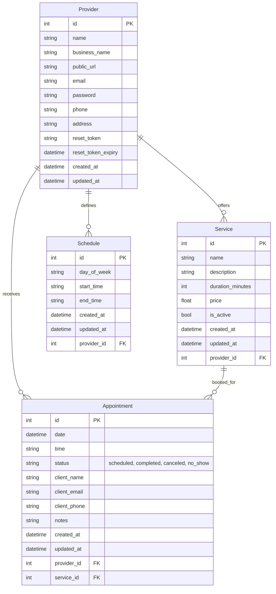
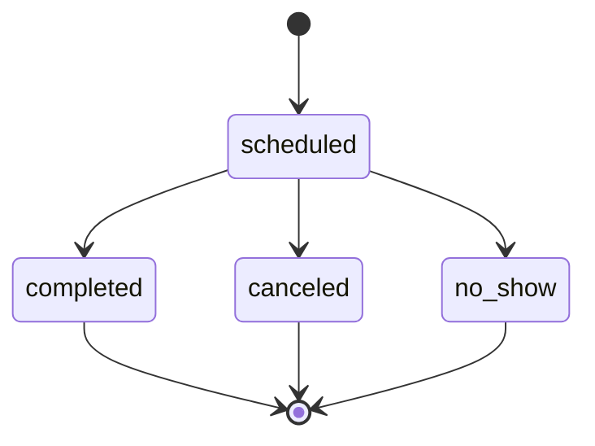

# Levantamento de Requisitos – Agenda Única (MVP)

## 1. Problema Identificado
Falta de uma visão clara do faturamento futuro e dos agendamentos realizados pelos profissionais.

## 2. Justificativa
A digitalização do agendamento é uma demanda crescente dos clientes e do mercado, tornando urgente a adoção dessa solução para manter a competitividade e atender às expectativas dos usuários.

## 3. Objetivos do Projeto
- Permitir que profissionais visualizem facilmente o faturamento previsto para o mês.
- Facilitar o agendamento para clientes, reduzindo o tempo e a fricção no processo.

## 4. Escopo
**Incluído:**
- Plataforma web simples (sem app mobile)
- Agendamento de serviços de maneira individual
- Painel administrativo para prestadores, com funcionalidades de gerenciamento e acompanhamento dos agendamentos
- Notificações por e-mail para clientes e profissionais

**Excluído:**
- Aplicativo mobile
- Pagamento online
- Agendamento para grupos/eventos
- Funcionalidades avançadas de marketing ou fidelidade

## 5. Requisitos Funcionais
- Cadastro e edição dos dados do prestador de serviço
- Cadastro e edição de serviços
- Definição de horários de atendimento por dia/turno
- Agendamento online pelo cliente (sem necessidade de cadastro prévio)
- Painel para o profissional visualizar, editar e marcar status dos agendamentos (compareceu, cancelou, faltou)
- Notificações automáticas por e-mail para confirmação e lembrete de agendamento
- Dashboard com previsão de faturamento e resumo dos agendamentos

## 6. Requisitos Não Funcionais
- Interface responsiva (funciona bem em desktop e mobile web)
- Tempo de resposta inferior a 2 segundos nas principais ações
- Sistema seguro para proteção dos dados dos usuários

## 7. Critérios de Aceitação
- O sistema deve permitir que o profissional cadastre um serviço com nome, descrição, duração e valor, e visualize na lista de serviços.
- O cliente deve conseguir agendar um serviço em menos de 1 minuto, sem criar conta.
- O painel do profissional deve exibir o faturamento previsto do mês atual.
- O sistema deve enviar e-mail de confirmação imediatamente após o agendamento, tanto para o cliente quanto para o prestador.
- O prestador deve conseguir marcar um agendamento como concluído, cancelado ou que o cliente não compareceu.

## 8. Riscos e Premissas
- Risco: Profissionais podem ter resistência ao uso de tecnologia.
- Risco: Dependência de serviços de e-mail para notificações.
- Premissa: Usuários terão acesso à internet para utilizar a plataforma.

## 9. Modelagem dos Dados (ER Diagram – Mermaid)

## 10. Fluxo de Estados do Agendamento (State Diagram – Mermaid)

---

Caso queira revisar ou aprofundar algum tópico, basta solicitar!

**Próximos passos sugeridos:**
- Validação técnica do levantamento com o time
- Refinamento de requisitos ou prototipação
- Planejamento do desenvolvimento do MVP
